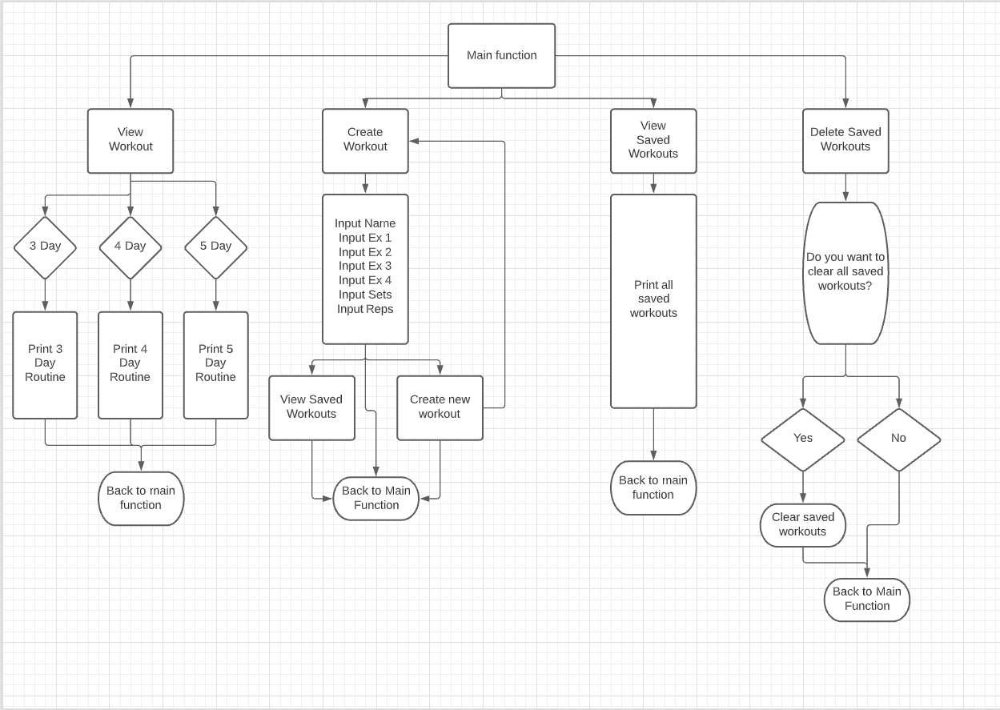
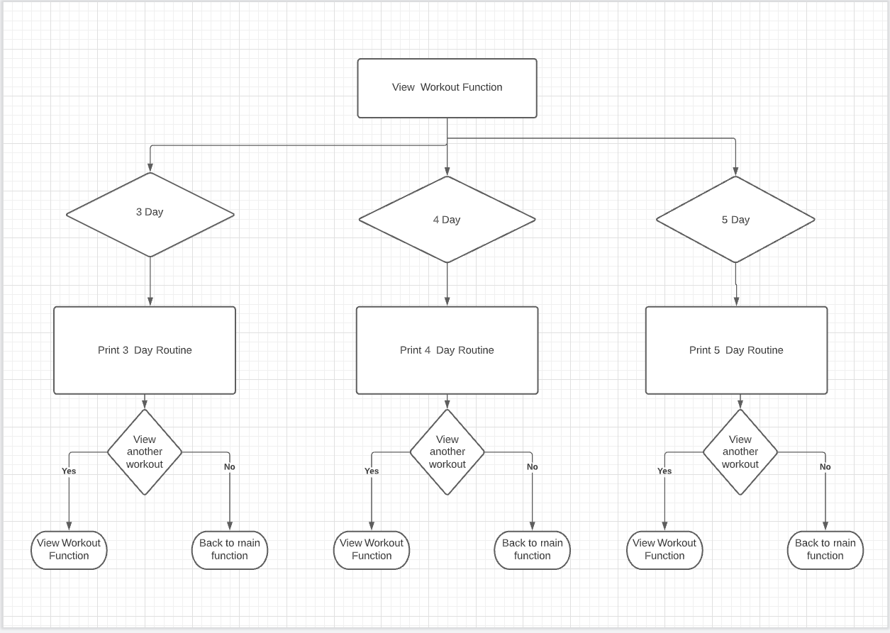
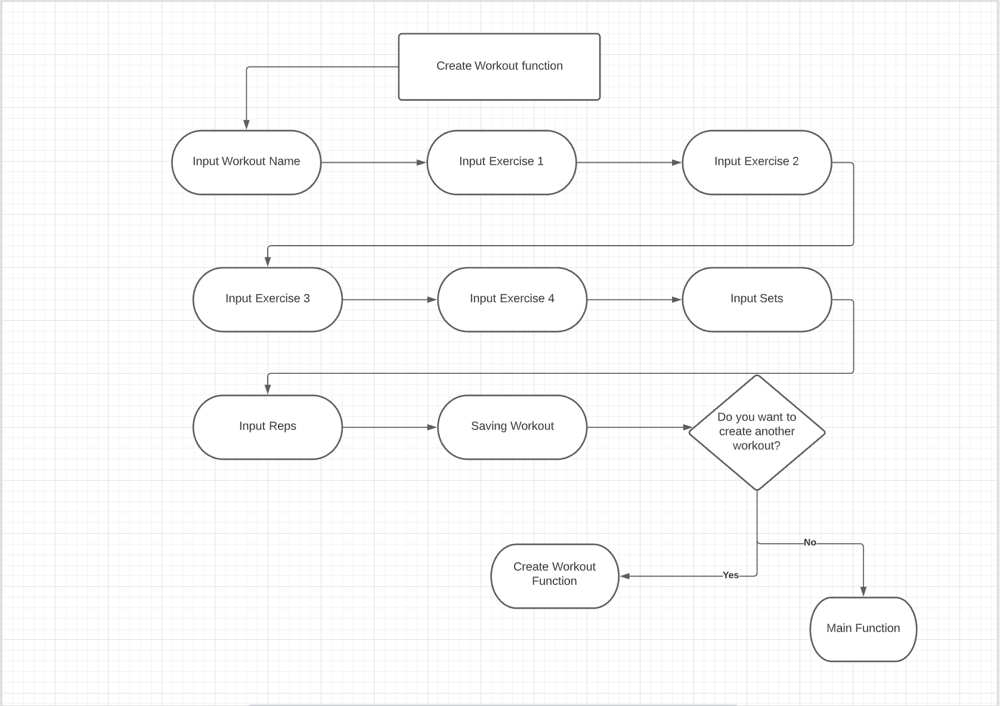
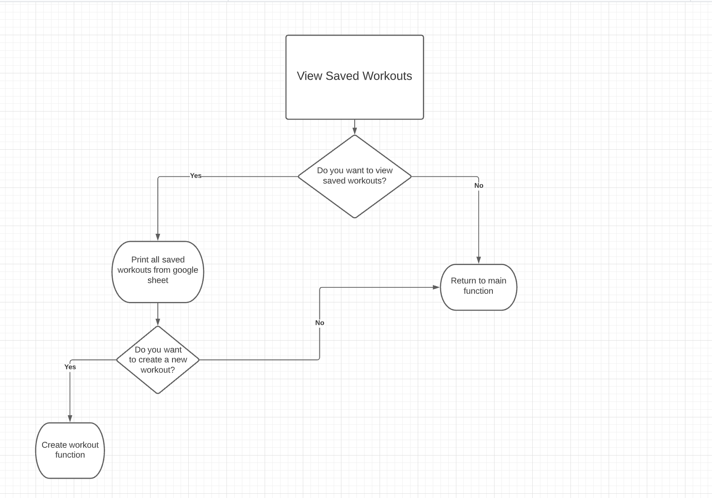
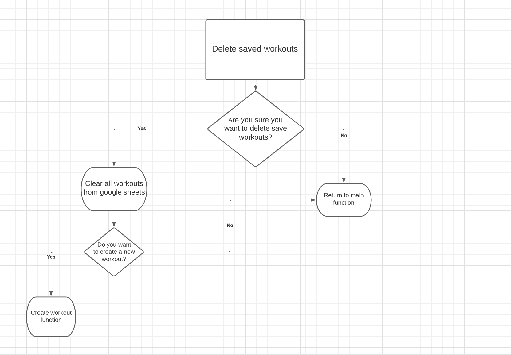

# Gym Buddy

Gym Buddy's main goal is to support the users gym expereince. With Gym Buddy the user view a fixed workout routine, can create their own workout routine, and manage their saved workouts. When users choose to view a fixed workout they are given a three day, four day and five day option and the option they choose will be viewed on the command line. 

When Users create their own workout they can set 4 exercises and their own sets and reps to line up with their goals. Users will then get the option to view their newly created workout so they can track their progress during their workout session. 

Other Gym Buddy features the user can utilise is clearing their saved workouts in the scenario that the created workout no longer fits there fitness goals.

Gym Buddy is a Python run command line automation. The users workout data is stored in a spreadsheet run with Google Sheets which is then connected via Google Cloud and credentials are set via Google Drive. Then the Google Auth library sets up the authentication allowing the access of Gspread to update the spreadsheet.

## Project Planning Phase

My main goal for this project was to create an application that a user can access stored workouts and create their own as it would save users using pen and paper when recording their workout routines and give them a place to store their fixed routines.

### Main Function Flow Chart

I started by planning out my main function and all the different functions that they would allow the user to run through.

### View Workout Flow Chart

This flowchart shows my thought process on what needed to be achieved by the View Workout function. The user picks either a three day, four day or five day workout routine depending on their goals. Then the user gets to view the workout routine and the option to view another if it didn't line up with their goals or they can head back to the main function to continue navigating through the Workout Buddy.

### Create A Workout Flow Chart

This flowchart shows my thought process on what needed to be achieved by the Create Workout function. The user gets to name the workout, add four exercises and add the sets and reps for the workout. This allows the user a certain amount of personalisation when creating their workout.

### View Saved Workouts Flow Chart

This function is simpler then the previous two so the flow chart is not too detailed but it allowed me to hit the specific criteria needed for the function. This allows the user to view there previously created workouts. 

### Delete Saved Workouts Flow Chart

This function allows the user to clear the saved workouts they have previously created.