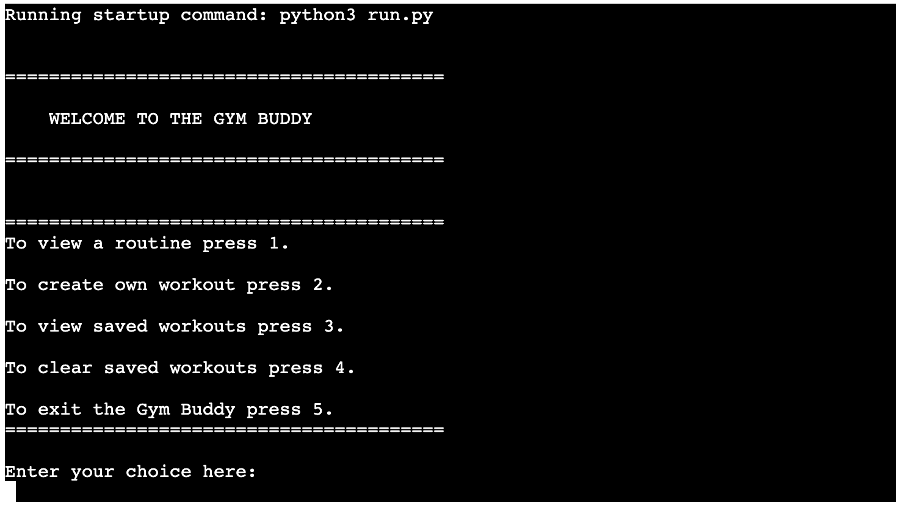

# Gym Buddy

Gym Buddy's main goal is to support the end user's gym expereince. With Gym Buddy, the user is able to view a fixed workout routine, create their own workout routines, and manage their saved workouts. 

When users choose to view a fixed workout, they are given the option to select a three day, four day, or five day routine, and the option they choose will be displayed on the command line. 

When users create their own workout, they can set 4 exercises and the number of sets and reps they wish to complete in order to achieve their goals. Users will then get the option to view their newly created workout so they can track their progress during their workout session. 

Other Gym Buddy features the user can utilise is clearing their saved workouts in the scenario that the created workout no longer fits their fitness goals.

Gym Buddy is a Python-run command line automation. The user's workout data is stored in a spreadsheet run with Google Sheets, which is then connected via Google Cloud. The credentials are set up via Google Drive. Then the Google Auth library sets up the authentication, allowing Gspread to access to update the spreadsheet.

Below is the link to the Google Sheet gym-buddy where the workouts are stored and read from.

[Google Sheet](https://docs.google.com/spreadsheets/d/1fED3r7gZtCM7tjjfmE5oM001Gy1Y5DCf0PS5zHV99SA/edit?usp=sharing)

## Project Planning Phase

The main goal for this project was to create a simple, user-friendly application that allows the user to: 

1) Access pre-defined workout routines
    - Pre-defined workout routines that cater to the number of times the user wants to workout a week remove the stress involved in thinking of suitable exercises and saves time. 

2) Create their own workout routines
    - The ability to create your own workout offers flexibility for the user, and is a natural progression of the pre-defined workouts as it acknowledges users will be more confident in knowing what works best for them with experience. 

3) View (and clear) saved workouts
    - Providing an easily-managed location and means to store personalised workout routines makes it easier for users to track their progress and plan their workout routines.

# User Stories + Acceptance Criteria

These three project goals informed the user story and acceptance criteria that guided the development of the project, as detailed below:

A1) As a user, I want clear instructions on how to navigate and use the app so that it is easy to use.

A2) As a user, I want to be able to view a pre-defined workout routine based on the number of workouts I wish to complete each week.

A3) As a user, I want to be able to create my own workout and save this workout for future reference.

A4) As a user, I want to be able to both view and clear any saved workouts as I wish.

### Main Function Flow Chart

The project was initiated by mapping out the main function and all supporting functions required to meet the acceptance criteria and goals of the project. These functions were separated in such a way to optimise the simplicity of the application for the user, and provide clear instructions for navigating the application, in alignment with the acceptance criteria (A1).

### View Workout Flow Chart

This flowchart shows the thought process of what needed to be achieved by the View Workout function, in alignment with the acceptance criteria (A2). The user picks either a three day, four day or five day workout routine depending on their goals and time allowances. Then the user gets to view a pre-defined workout routine based on the option they select. The user also has the option to view another routine if the one they selected didn't line up with their goals, or they can head back to the main function to continue navigating through the Workout Buddy app.

### Create A Workout Flow Chart

This flowchart shows the thought process of what needed to be achieved by the Create Workout function, in alignment with the acceptance criteria (A3). The user gets to name the workout, add four exercises, and add the sets and reps for the workout. This allows the user a degree of flexibility in personalising their workouts to meet their goals.

### View Saved Workouts Flow Chart

This function is more simple than the previous two, so the flow chart is not as detailed. However, it allows for the specific criteria needed for the function, in alignment with the acceptance criteria (A4). This allows the user to view their previously created workouts so as to remain consistent in achieving their targets. 

### Delete Saved Workouts Flow Chart

This function allows the user to clear the saved workouts they have previously created, in alignment with the acceptance criteria (A4).

## Features

### Welcome to Gym Buddy

Upon starting Gym Buddy, the user is greeted to a welcome message. Below this, the user has a main menu with the options that allow the user to:

- View a pre-defined workout routine
- Create their own workout
- View previously saved personalised workouts the user has created
- Delete all previous saved workouts the user has created
- Close the Gym Buddy.

### View A Workout Routine

Here the user is able to choose between a pre-defined three-day, four-day, or five-day workout routine. The chosen routine is then printed out to the terminal and the user gets the option to view another routine or return to the main menu where they can continue to navigate Gym Buddy.

### Create A Workout

This option allows the user to create their own workout. The user is able to personalise it by choosing a name for the workout, before they define four exercises and the respective number of sets and reps depending on their goals. When they are finished creating their own workout, it is saved to the spreadsheet and the user gets the option to create a new workout, view their saved workouts, or return to the main menu. 

### View Saved Workouts

This option allows the user to view their previously created workouts. The workouts get printed to the screen and the name, exercises, sets and reps get shown to the user. The user is then given the option to create a new workout, or return to the main menu.

### Delete Saved Workouts

This option allows the user to delete all of their previously created workouts, giving them a clean slate to create new workouts depending on their changing workout goals. The user is then given the option to create a new workout, or return to the main menu.

### Exit Gym Buddy

This option closes down the Gym Buddy, giving the user a thank you message and the option to restart the Gym Buddy, therby returning to the Welcome Message on the first screen and the main menu.

### Input Validation

All input options have validations in place so that an error message pops up if you enter the wrong input. This is shown in an example below.

## Features left to implement

- The ability to track workouts by entering the weights used for each exercise so that the user can tailor their routines and follow their progress.
- The option to include an estimated one rep max for each excercise, and the automatic incrementation of the weight for the user.

These additional features, which could be included in future iterations, would make the app more interactive for the user and offer greater flexibility to the users in tracking their progress, in turn ensuring users continue to get value from using the app.

## Testing

All the files pass the [PEP8](http://pep8online.com/) test successfully. As shown below.

Furthermore, the screenshots provided above in the features section provide evidence for User Acceptance Testing that was carried out in order to ensure that the acceptance criteria of the project were met.

## Bugs

Bugs encountered and resolved during development:

- Clearing saved workouts
    - When the user opted to clear their saved workouts, the clear_saved_workouts function cleared the entire workout worksheet, including the fixed column headers. This was due to use of the clear() method, which clears all cells in the worksheet. This was fixed by using the batch_clear() method, which clears batches of cell ranges in a single API call. 

- Appending new saved workouts to the worksheet
    - When the user saved their newly created workout, the new row entry was inserted before the column headers. This was due to the incorrect use of the insert_rows() method, and in turn resulted in the returned workout dictionary being incoherent to end user. This was resolved by using the append_rows() method, which inserts the new data after the last row in the worksheet.

- Input field not showing after create own workout saved
    - When the user created their own workout and it was saved to the Google sheet they would get shown a menu of where to go next with no input field for their answer. The user would have to press enter to then load the input field. The issue was resolved as there was a empty parentheses on the while loop clause. Below images show the bug on the deployed project. This was resolved by removing the parentheses.

Existing bugs:

- There is the minor existing issue of the returned saved workout dictionary not being sorted in the order of the columns as presented in the worksheet. Instead, the column headers are sorted alphabetically. This is not a major issue because the returned data is not made confusing the end user and still reads well, however it is something that could be improved upon in future if necessary.

## Deployment

### The app has been deployed in Heroku.

For this app to deploy in Heroku, you need to add the requirements to the Gitpod workspace using the command `pip3 freeze > requirements.txt`. This tells Heroku the dependencies that need to be imported.

In Heroku, you create a new application and insert the config vars necessary for the code to deploy. The two variables set are `CREDS = creds.json` and `PORT = 8000`. After this, the buildpacks Python and Node.js are added in order to ensure the dependencies required to configure the app are imported. Then, the app is connected to the GitHub repository for gym-buddy, before it is finally able to be deployed. 

The link to an a running gym-buddy app is below.

[The app is running here](https://gym-buddy-pp3.herokuapp.com/)

## Used Technologies

# Languages
    - Python (v.3.8.11)

# Programmes used

    - Git
        - For maintaining version control, commiting and pushing to Github.
    - Github
        - For the management and storage of the code repository for this project - including files and images pushed from Gitpod.
    - Gitpod
        - An IDE used to develop the application.
    - Heroku
        - A platform used to deploy the application.
    - Lucidchart
        - An application used to create the flowcharts to map the project planning phase and logic flow for the code processes.

### Python Libraries

#### Gspread

Gspread is a Python API for Google Sheets. It allows us to read, write, update and delete data from a spreadsheet. To install it you use `pip install gspread` and then you have to open a project as a client `GSPREAD.CLIENT.open('name of the project')` and link your worksheet `worksheet('name of the worksheet')`.

This app used gspread to read and store workouts on the Google sheet. 

The link for further reading on gspread: https://docs.gspread.org/en/v5.1.1/

#### Google Auth

Google auth  allows us to access Google Cloud safely through a method called Credentials.

We have to call a method called 'from_service_account_file' and pass in our Credentials as a parameter. We get our Credentials from our Google Cloud account inside the project we are working with, and save it as an enviromenment variable in our local project.

Then, using the previous variable created we call the 'with_scopes' method, passing into it the scope that we need to authorize.

Finally, we need to authorize the gspread library to work in our project. To do that, gspread has a method called 'authorize' in which we have to pass the previous created variable in which we saved the scope variables.

https://console.cloud.google.com

#### PPrint

PPrint provides a capability to “pretty-print” arbitrary Python data structures in a form which can be used as input to the interpreter. This was used when printing the data from the Google Sheet as the readability of data enhanced the user experience.

https://docs.python.org/3/library/pprint.html

## Credits

- The get_input function for input validation was taken from CodeSavant on YouTube. https://www.youtube.com/watch?v=EBP1ox3SQfA

- As aforementioned, there were bugs encountered during the development process of this project, which required external sources to resolve:
    - To resolve the issue with clearing the entire workout worksheet, including the column headers, the batch_clear() method was used in place of the clear() method. The batch_clear() method was obtained from the gspread documentation, found here: https://docs.gspread.org/en/latest/user-guide.html
    - To resolve the issue with inserting rows to the workout worksheet before the column headers, the append_rows() method was used in place of the insert_rows() method. The append_rows() method was also obtained from the gspread documentation, found here: https://docs.gspread.org/en/latest/api.html.

